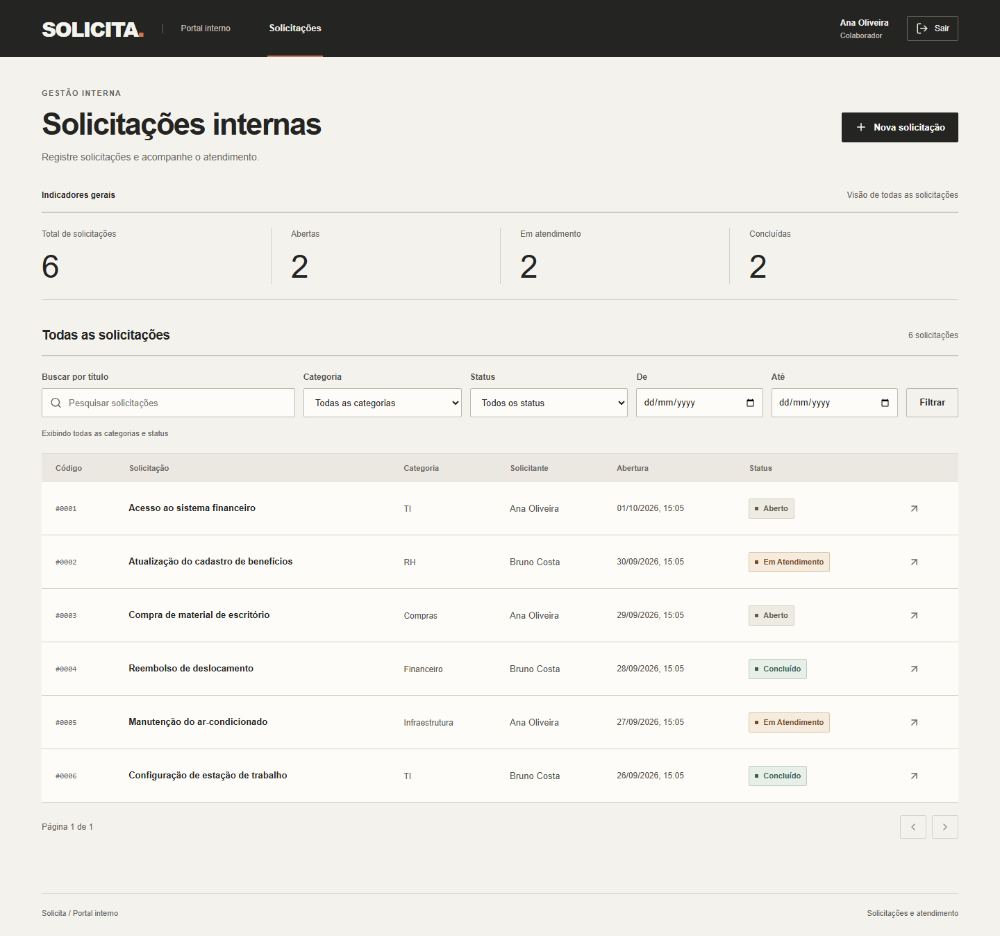

# Solicita - Portal de Solicitações Internas

Mini-projeto Full Stack para a seleção DEV Jr. da bit Soluções. **MVP implementado localmente** com frontend React, API Express, banco SQLite, testes automatizados e desenvolvimento orientado a especificações. Prazo do enunciado: 05/10/2026.



## Funcionalidades

Login/logout e sessão persistida; criação de solicitações com autoria/data/status automáticos; edição/exclusão de solicitações próprias abertas; fila compartilhada e detalhes; atendimento até conclusão; pesquisa combinada por período, título, categoria/status; paginação e indicadores gerais. Interface em português com layout para desktop e 360 px, labels, validações e feedback de erro/carregamento/vazio.

Premissas do produto, por não serem definidas no PDF: somente autor edita/exclui; todos os colaboradores podem visualizar e atender; fluxo Aberto -> Em Atendimento -> Concluído, sem reabertura; dashboard não depende dos filtros. Consulte [PRD](docs/PRD.md).

Identidade visual: fundo quente, preto, linhas finas, tipografia forte e cantos quase retos, inspirados no projeto Truckfighters do usuário e adaptados ao uso corporativo geral. Cabeçalho horizontal, indicadores em faixa e textos objetivos. Critérios em [SPEC-004](specs/004-visual.md).

## Pré-requisitos

- **Node.js 24 LTS, versão 24.15 ou superior dentro da linha 24**; validado com 24.16.0.
- npm 11, validado com 11.13.0; versões diretas fixadas e package-lock.json incluído.
- SQLite vem com better-sqlite3: não é necessário instalar um servidor de banco.
- Python 3.12+ somente para os testes preparatórios em tests/specs; não é necessário para usar a aplicação.
- Internet na instalação de dependências e do navegador de testes; execução da aplicação não depende de serviços externos.

Execute todos os comandos **na raiz desta pasta**, onde está package.json. Em PowerShell, use npm.cmd/npx.cmd se a política da máquina bloquear npm.ps1/npx.ps1.

## Instalação e banco

Código em [jotavtech/portal-solicitacoes](https://github.com/jotavtech/portal-solicitacoes). O repositório é privado e requer acesso autorizado. Para clonar:

```sh
git clone https://github.com/jotavtech/portal-solicitacoes.git
cd portal-solicitacoes
```

```sh
npm ci
```

Copie as configurações. PowerShell:

```powershell
Copy-Item .env.example .env
```

Linux/macOS:

```sh
cp .env.example .env
```

Depois:

```sh
npm run db:migrate
npm run db:seed
```

O banco padrão é data/portal.sqlite. Migrations também são conferidas ao iniciar a API; aplicadas uma vez, em transação, com checksum. Seed é explícito e idempotente: cria dois colaboradores, seis demandas e registra sua aplicação; não sobrescreve senhas existentes. Nunca recriar o banco como parte normal do startup.

.npmrc desabilita scripts de instalação implícitos: as dependências utilizadas distribuem os binários necessários. Isso evita compilação node-gyp desnecessária no Windows para o driver escolhido. Comandos explícitos npm run funcionam normalmente. Instalação limpa com essa configuração foi conferida neste ambiente; decisão em [ADR-002](docs/adr/002-runtime-and-validation.md).

## Usuários de demonstração

| Usuário | Senha pública de demonstração | Nome |
| --- | --- | --- |
| ana | Ana-demo-2026! | Ana Oliveira |
| bruno | Bruno-demo-2026! | Bruno Costa |

Disponíveis após o seed em banco novo. Credenciais exclusivamente para avaliação/demonstração. Se o usuário já existir, o seed preserva sua senha. Sem cadastro público. Seed não roda automaticamente e o comando de demonstração é bloqueado com NODE_ENV=production.

## Desenvolvimento

```sh
npm run dev
```

Frontend: **http://127.0.0.1:5173**. API: **http://127.0.0.1:3001/api**. O frontend usa proxy /api para manter mesma origem. Também existem npm run dev:api e npm run dev:web para terminais separados. Encerrar com Ctrl+C.

## Aplicação compilada, para demonstração local

```sh
npm run build
npm start
```

Acesse **http://127.0.0.1:3001**. O backend serve frontend/API e rotas de navegação; rotas inexistentes da API continuam JSON 404. Mantenha o .env de desenvolvimento para essa demonstração HTTP local. Deploy HTTPS e processo de produção estão em [DEPLOY.md](docs/DEPLOY.md).

## Configuração

| Variável | Padrão | Uso |
| --- | --- | --- |
| NODE_ENV | development | development/test/production; produção exige cookie seguro. |
| PORT | 3001 | Porta da API; o proxy de desenvolvimento lê a mesma configuração. |
| DATABASE_PATH | ./data/portal.sqlite | Arquivo SQLite em diretório gravável e persistente. |
| APP_TIMEZONE | America/Sao_Paulo | Fuso dos filtros de período da API. |
| VITE_APP_TIMEZONE | America/Sao_Paulo | Fuso público de apresentação; manter igual ao da API; exige novo build ao alterar. |
| SESSION_TTL_SECONDS | 28800 | Duração absoluta, até 86400 segundos. |
| COOKIE_SECURE | false em desenvolvimento | true obrigatório em produção HTTPS. |
| TRUST_PROXY_LOOPBACK | false | true apenas para reverse proxy local confiável. |
| DEMO_SEED_ENABLED | false | Opt-in alternativo ao argumento --demo já usado por db:seed. |

Nunca versionar .env, bancos ativos, sessões ou segredos. Datas são persistidas em UTC e apresentadas no fuso configurado. Cookies HttpOnly, SameSite=Lax, CSRF e hash scrypt protegem a sessão.

## Testes e verificações

```sh
npm run check
npx playwright install chromium
npm run test:e2e
```

check executa TypeScript estrito, ESLint, validação formal OpenAPI, Vitest e build. Vitest inclui regras, HTTP/SQLite real, compatibilidade de respostas com OpenAPI e componentes React. Playwright executa jornadas desktop e 360 px, com servidor real e banco temporário separado. Não usa seu banco de demonstração.

```sh
python -m unittest discover -s tests/specs -p "test_*.py" -v
```

Testes preparatórios Python continuam separados dos testes da aplicação. Outros comandos: npm run test:watch, npm run test:coverage, npm run format. Percentual de cobertura não foi usado como substituto dos cenários de aceite.

Para regenerar capturas reais com dados limpos de demonstração:

```sh
npm run build
npm run evidence
```

Esse comando usa porta 4180 e banco temporário; E2E usa 4173. As portas devem estar livres. Capturas estão em [docs/evidence](docs/evidence/README.md), relatórios de teste locais em playwright-report/test-results. Workflow de CI inclui tipos/lint/contrato/testes/build/E2E e verificações de especificação; execução remota iniciada em [GitHub Actions](https://github.com/jotavtech/portal-solicitacoes/actions/runs/36905994819), ainda em andamento no registro da entrega.

## Organização e documentação

```text
apps/api/src/            autenticação, controllers, serviços, SQL, configuração e CLI
apps/web/src/            páginas, componentes, autenticação e cliente HTTP
packages/contracts/      schemas runtime Zod e tipos compartilhados
database/                migrations SQL versionadas
tests/e2e/               jornadas Playwright
tests/specs/             verificações preparatórias Python
scripts/                 build, validação, servidor E2E e capturas
specs/                   comportamentos e OpenAPI
docs/                    PRD, arquitetura, decisões, testes, memorial e evidências
```

- [AGENTS.md](AGENTS.md): fluxo spec driven, testes e regras para colaboradores.
- [Arquitetura](docs/ARCHITECTURE.md), [dicionário de dados](docs/DATA_DICTIONARY.md) e [OpenAPI](specs/openapi.json).
- [Plano de testes](docs/TEST_PLAN.md), [rastreabilidade](docs/TRACEABILITY.md) e [verificação](docs/VERIFICATION.md).
- [Memorial Técnico de Desenvolvimento](docs/MEMORIAL_TECNICO.md) e [plano de implementação](docs/IMPLEMENTATION_PLAN.md).

## Limitações

Processo único, SQLite em volume persistente, limitador de login em memória; sem papéis de atendimento especializados, auditoria, reabertura ou recuperação de senha. Duas edições simultâneas abertas seguem último write válido; avanço de status bloqueia edição/exclusão posteriores. Docker, CI/CD de deploy e vídeo não foram implementados. Código enviado ao GitHub em repositório privado. Envio ao recrutador e deploy externo não foram realizados.
