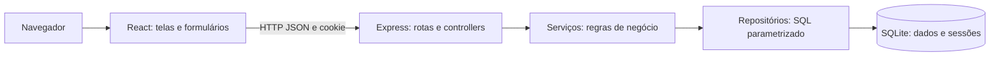

# Arquitetura implementada

Estado: arquitetura do MVP implementado localmente. Ver [ADR-001](adr/001-stack-and-scope.md).

## Componentes e responsabilidades

Monorepo com `apps/api`, `apps/web` e `packages/contracts`. O pacote de contratos contém schemas runtime e tipos compartilhados; não inclui conexão de banco, segredos ou regras de autorização. Evitar camadas genéricas ou abstrações sem uso concreto.

Backend por funcionalidades: `auth`, `requests`, `dashboard`. Controller traduz HTTP, serviço aplica decisões do PRD, repositório realiza consulta/transação. Middleware de autenticação e CSRF, validação e handler de erros centralizados. A aplicação Express deve ser instanciável sem abrir porta, para testes de integração com Supertest.

Frontend: telas login, painel, formulário e detalhe; cliente HTTP central envia cookie/CSRF e normaliza erros. Estado de sessão carregado na inicialização. Navegação protegida é conveniência; proteção real está na API. Consultas são atualizadas depois de mutações concluídas; sem cache permanente em localStorage.

## Persistência

SQLite é relacional e cumpre o requisito SQL. `database/001_schema.sql` é executável e deve virar primeira migration versionada. Tabelas: users, requests, sessions. Um arquivo de banco por ambiente; banco temporário por teste de integração. Foreign keys ativadas em cada conexão, busy timeout configurado e transações curtas. Consulta de dashboard em uma agregação; edição/exclusão com condições de autoria/status na mesma escrita.

Migrations futuras são incrementais; não editar migration já aplicada como única forma de upgrade. Não usar recriação destrutiva para iniciar a aplicação. Seed é opt-in e idempotente, sem sobrescrever usuários existentes. Dados de demonstração devem permitir testar todos os status, categorias e ao menos dois autores.

## Segurança e erros

Sessões e CSRF conforme SPEC-001; senha scrypt com salt, N=32768, r=8, p=3, salt de 16 bytes e chave de 64 bytes e comparação pela primitiva adequada. Cookie opaco com hash persistido, invalidado no logout/expiração e rotacionado no login. Não introduzir JWT apenas para evitar persistir sessão.

Produção usa mesma origem para frontend/API e HTTPS. Desenvolvimento usa proxy Vite `/api` para Express, preservando mesma origem vista pelo navegador. Cookies Secure apenas em HTTPS; se houver reverse proxy, configurar confiança em proxies conhecidos. Sem CORS amplo com credenciais.

Headers de segurança, limite de corpo JSON de 32 KiB, limitação de login, SQL parametrizado, validação estrita de entrada e logs sem secrets. Payload de erro: `{error: {code, message, fields?, requestId}}`. Campos de erro referenciam campos do formulário; mensagem inesperada é genérica. IDs de request não contêm dados pessoais.

## Datas e UI

Persistir timestamps canônicos em UTC, com milissegundos (`YYYY-MM-DDTHH:mm:ss.sssZ`), para comparação e ordenação consistentes. Servidor e cliente exibem o fuso `APP_TIMEZONE`, padrão America/Sao_Paulo. Conversão de fronteiras de datas civis deve usar biblioteca de fuso ou implementação testada; implementada com Temporal polyfill e verificada em testes.

React renderiza conteúdo como texto; não usar HTML arbitrário para descrições. Inputs com labels, erros associados, foco previsível e botões com nome acessível. Layout funciona em 360 px sem esconder ações essenciais.

## Execução e operação previstas

Desenvolvimento: API e Vite, banco local. Produção simples: build do frontend servido pelo backend, `/api` reservado para API, fallback SPA apenas em rotas de página. 404 da API permanece JSON. Processo Node único e volume persistente para SQLite, diretório gravável e cópias de segurança documentadas. Não usar hospedagem com disco efêmero para persistência sem volume.

`.env.example` define as variáveis implementadas; comandos descritos no README. Build, migration, seed e testes devem funcionar a partir de clone limpo. CI configurado para especificação/esquema, tipos, lint, unitários, integração, componentes, E2E e build; executado e aprovado remotamente; consultar VERIFICATION.md.

## Limitações e evolução

Fila compartilhada sem perfis especializados; sem auditoria, reabertura, controle otimista de versão ou recuperação de senha. Sessões e SQLite atendem um processo; escala horizontal exige revisar persistência, limitação de tentativas, sessões e estratégia de banco. Não afirmar alta disponibilidade ou adequação irrestrita para produção.

## Referências oficiais consultadas em 01/10/2026

- [React: componentes e estado](https://react.dev/learn)
- [Express: práticas de segurança](https://expressjs.com/en/advanced/best-practice-security/)
- [SQLite: foreign keys por conexão](https://www.sqlite.org/foreignkeys.html)
- [Vitest: guia inicial](https://vitest.dev/guide/)
- [Playwright: instalação e execução](https://playwright.dev/docs/intro)

Referências consultadas para o desenho; execução local e versões fixadas registradas no README, lockfile e VERIFICATION.md. ADR-002 completa bibliotecas concretas e política de instalação.
