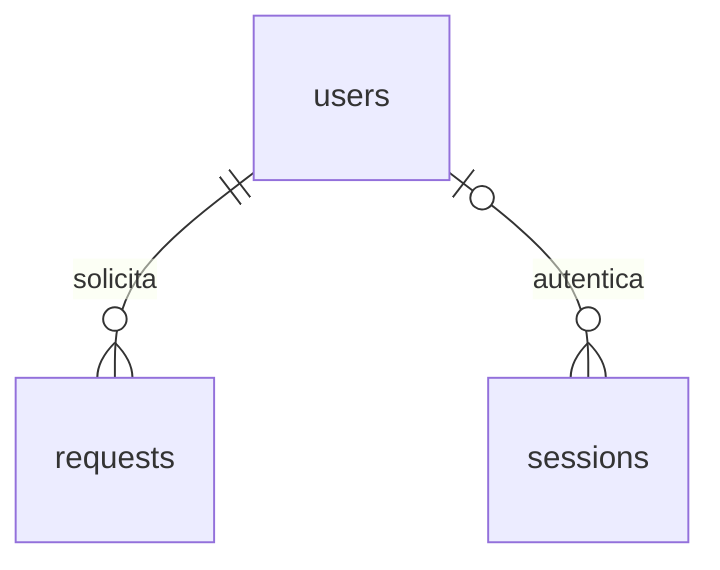

# Dicionário de dados

Fonte técnica: `database/001_schema.sql`. Estado: esquema utilizado pela aplicação e pelas suites de integração. Tipos SQLite; IDs inteiros positivos. Datas no formato UTC canônico `YYYY-MM-DDTHH:mm:ss.sssZ`; timestamps de criação/atualização são definidos pelo servidor. FK habilitada por conexão.

## users

| Coluna | Tipo / nulidade | Significado e regra |
| --- | --- | --- |
| id | INTEGER PK | Identificador do colaborador. |
| username | TEXT NOT NULL UNIQUE | Login em minúsculas, 3-50 caracteres ASCII permitidos; aplicação normaliza. |
| name | TEXT NOT NULL | Nome de apresentação, 1-100 pontos de código após aparar. |
| password_hash | TEXT NOT NULL | Hash scrypt codificado com salt/parâmetros; não é senha nem dado público. |
| created_at | TEXT NOT NULL | Criação UTC, default do banco no esquema inicial. |

Não há tabela de papéis ou cadastro público. Mudanças de usuário não fazem parte do MVP.

## requests

| Coluna | Tipo / nulidade | Significado e regra |
| --- | --- | --- |
| id | INTEGER PK AUTOINCREMENT | Código visível da solicitação; nunca reutilizado depois de exclusão confirmada. |
| title | TEXT NOT NULL | Título aparado, 3-120 pontos de código. |
| description | TEXT NOT NULL | Descrição aparada, 10-5000 pontos de código; exibida como texto. |
| category | TEXT NOT NULL | TI, RH, COMPRAS, FINANCEIRO, INFRAESTRUTURA. |
| requester_id | INTEGER NOT NULL FK users.id | Autor imutável. FK RESTRICT protege referências. |
| status | TEXT NOT NULL DEFAULT ABERTO | ABERTO, EM_ATENDIMENTO, CONCLUIDO. |
| created_at | TEXT NOT NULL | Criação UTC, imutável. |
| updated_at | TEXT NOT NULL | Última modificação efetiva; aplicação atualiza no write; repetição do mesmo status não altera. |

Índices: criação/ID descendentes, status/criação, categoria/criação e autor. ID não é número de chamados em aberto. Exclusão é física. Dashboard considera apenas linhas existentes.

Trigger bloqueia conteúdo alterado quando o estado anterior não é ABERTO, mudança de autor/data inicial e transição inválida. Autorização por usuário autenticado é responsabilidade da API: o banco não conhece a identidade da sessão HTTP. Aplicação usa condições de autoria/status no SQL e traduz violações para respostas do contrato.

## sessions

| Coluna | Tipo / nulidade | Significado e regra |
| --- | --- | --- |
| token_hash | TEXT PK NOT NULL | SHA-256 em hexadecimal do token aleatório do cookie; 64 caracteres; nunca retornado. |
| user_id | INTEGER NULL FK users.id | NULL significa sessão anônima somente para CSRF. Exclusão de usuário remove sessões com CASCADE. |
| csrf_token | TEXT NOT NULL | Token criptograficamente aleatório ligado à sessão; público apenas à própria sessão. |
| created_at | TEXT NOT NULL | Início da sessão UTC. |
| expires_at | TEXT NOT NULL | Expiração absoluta UTC, posterior à criação; sessão autenticada dura 8 horas por padrão (configurável). |

Índice de expiração para limpeza. Middleware rejeita sessão vencida mesmo antes da limpeza periódica. Token bruto do cookie não é salvo no banco. Não registrar tokens ou hash de senha em logs/evidências.

## Relacionamentos

`requester` na API é um objeto público montado por JOIN, não uma nova tabela. `createdAt`/`updatedAt` são os nomes JSON correspondentes a `created_at`/`updated_at`.

## Criação e seed

Esquema executável uma vez por migration; repetição controlada pela tabela de migrations da implementação. Seed implementado cria dois usuários com senhas hasheadas e registros de demonstração em todos os estados. Nenhuma senha real ou usuário já ativo é criado por este script. Transições de dados de exemplo devem respeitar o mesmo fluxo da aplicação.

## Metadados de execução

`migrations`: name (PK), checksum SHA-256 do SQL e applied_at UTC, criados pelo migration runner. `seed_runs` (002_seed_registry.sql): name (PK) e applied_at UTC; registro demo-v1 impede recriação dos dados de demonstração. Não são tabelas de negócio.
